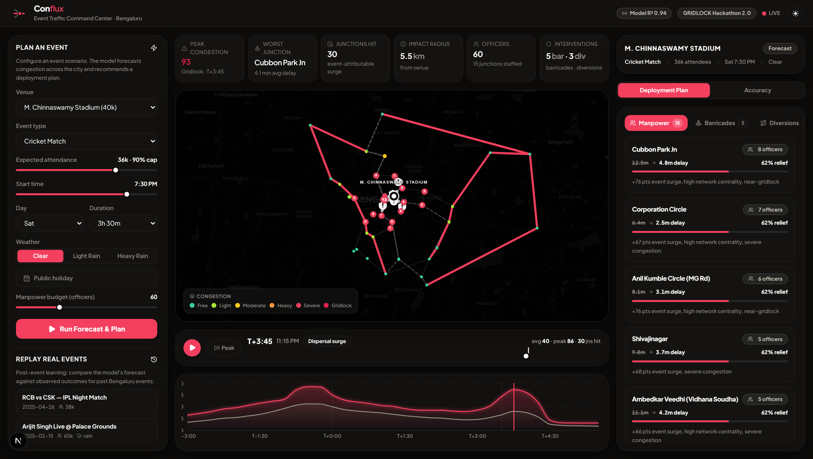

# 🚦 Conflux — Predictive Event Traffic Command Center

**Flipkart GRiDLOCK Hackathon 2.0 · Round 2 (Prototype Phase)**
**Theme 2 — Event-Driven Congestion (Planned & Unplanned)**

> *How can historical and real-time data be used to forecast event-related traffic
> impact and recommend optimal manpower, barricading, and diversion plans?*

Conflux turns an event (cricket match, concert, political rally, marathon,
protest, …) into a **space-time congestion forecast** for Bengaluru and an
**actionable deployment plan** — *before* the event happens. It is built for a
Bengaluru Traffic Police planning officer.



---

## The three pillars (mapped 1:1 to the problem statement)

| Pillar | What it does | Kills which pain point |
|--------|--------------|------------------------|
| **1. FORECAST** | An ML model predicts **per-junction congestion over time** (arrival → peak → dispersal), expected delay, impact radius, and the most-affected corridors. | *"Event impact is not quantified in advance."* |
| **2. RECOMMEND** | Converts the forecast into a plan: **manpower allocation** (optimised against a staffing budget), **barricade points**, and **diversion routes** drawn on the map. | *"Resource deployment is experience-driven."* |
| **3. LEARN** | A **predicted-vs-actual** replay for past events with accuracy metrics. | *"No post-event learning system."* |

Plus a **live scenario simulator** — drag attendance / start-time / weather and
watch the forecast *and* the deployment plan update instantly.

---

## How the ML actually works (honest version)

Because real CCTV/ANPR feeds aren't available in a prototype, Conflux is trained
on a **grounded synthetic dataset** — but the model still does real work:

1. **Real spatial backbone** — 38 real Bengaluru junctions (Silk Board, Hebbal,
   KR Puram, MG Road, Cubbon Park, …) wired into a road graph with lane counts,
   capacities, and **betweenness centrality** (`api/app/data/graph.py`), plus 8
   real venues with real capacities (`venues.py`).

2. **A physical generative model** (`features.py::ground_truth`) produces the
   "reality": baseline traffic by time-of-day/day-of-week + an event surcharge
   driven by attendance, event type, **distance-decay** from the venue, network
   funnel effects, an **arrival/dispersal temporal curve**, and weather.

3. **The model only sees raw, knowable-in-advance features** (attendance, type,
   distance, clock time, weather, …) — *not* the physics internals — so it has to
   **learn** the mapping. Two `HistGradientBoostingRegressor` models (congestion +
   delay) are trained and **evaluated on held-out, unseen events** (split by
   event, not by row — no leakage).

### Model performance (held-out set: 79 unseen events, ~103k samples)

| Target | R² | MAE | Skill vs. mean-baseline |
|--------|----|-----|--------------------------|
| **Congestion index** (0–100) | **0.94** | **3.05 pts** | **+77.5%** |
| **Avg delay** (min) | **0.82** | **0.49 min** | +53.7% |

**Post-event replay accuracy** (predicted vs. observed peak, % of junctions within 10 pts):

| Event | MAE | Within 10 pts |
|-------|-----|---------------|
| RCB vs CSK — IPL Night Match | 5.7 | 87% |
| Arijit Singh @ Palace Grounds | 4.2 | 90% |
| Farmers' Rally @ Freedom Park | 3.0 | 100% |
| Bengaluru FC Derby @ Kanteerava | 2.9 | 100% |
| TCS World 10K Marathon | 6.9 | 74% |
| Mass Protest @ Vidhana Soudha | 6.3 | 74% |

*(Marathons/protests are deliberately harder — route-based, not point-source — and
the model honestly shows higher uncertainty there.)*

---

## The recommendation engine (`api/app/ml/optimize.py`)

- **Manpower** — greedy **marginal-utility allocation**: each officer is sent to the
  junction with the highest remaining benefit (priority = event-surge × congestion ×
  centrality, with diminishing returns). Reports expected delay reduction per junction.
- **Barricades** — inflow-control points on the worst corridors *near the venue*,
  scored by impact × proximity.
- **Diversions** — **congestion-aware re-routing** (`networkx`): for cross-city
  through-traffic, compares the normal shortest path against one that penalises
  impacted edges, and surfaces reroutes that keep the event corridor clear.

---

## Architecture

```
┌────────────────────────┐        REST/JSON        ┌──────────────────────────────┐
│  web/  (Next.js 16)     │  ───────────────────▶   │  api/  (FastAPI · Python)     │
│  • Command-center UI    │                         │  • /simulate  (forecast+plan) │
│  • Leaflet map (OSM)    │   ◀───────────────────  │  • /events/{id}/replay        │
│  • Recharts timelines   │                         │  • HistGradientBoosting model │
│  • Scenario simulator   │                         │  • networkx routing engine    │
└────────────────────────┘                         └──────────────────────────────┘
        deploy: Vercel                                   deploy: container (Docker)
```

**Stack:** Next.js 16 (App Router) · TypeScript · Tailwind v4 · React-Leaflet · Recharts
· FastAPI · scikit-learn · NetworkX · pandas/numpy.

---

## ▶️ Run it

### Option A — Docker (one command, recommended for reviewers)

```bash
docker compose up --build
```

- Web → **http://localhost:3000**
- API → **http://localhost:8000** (interactive docs at `/docs`)

### Option B — Manual (two terminals)

**Terminal 1 — API**
```bash
cd api
python -m venv .venv
# Windows:  .venv\Scripts\activate     macOS/Linux:  source .venv/bin/activate
pip install -r requirements.txt
python -m app.ml.train          # optional — trained model is already committed
uvicorn app.main:app --reload --port 8000
```

**Terminal 2 — Web**
```bash
cd web
npm install
npm run dev                      # http://localhost:3000
```

> The web app defaults to `http://127.0.0.1:8000` for the API. Override with
> `NEXT_PUBLIC_API_URL` (see `web/.env.example`).

---

## API reference

| Method | Endpoint | Purpose |
|--------|----------|---------|
| `GET`  | `/api/venues` | Supported venues |
| `GET`  | `/api/event-types` | Supported event types |
| `GET`  | `/api/graph` | Junction/road network |
| `GET`  | `/api/metrics` | Model metrics + predicted-vs-actual sample |
| `POST` | `/api/simulate` | **Forecast + deployment plan** for a scenario |
| `GET`  | `/api/events` | Curated historical events |
| `GET`  | `/api/events/{id}/replay` | Predicted-vs-actual (post-event learning) |

Example:
```bash
curl -X POST http://localhost:8000/api/simulate -H "Content-Type: application/json" \
  -d '{"venueId":"chinnaswamy","eventType":"cricket","attendance":36000,
       "startHour":19.5,"dow":5,"rain":0,"durationMin":210,"manpowerBudget":60}'
```

---

## Project structure

```
Conflux/
├── api/                      # Python ML + FastAPI backend
│   ├── app/
│   │   ├── data/             # venues + Bengaluru road graph
│   │   ├── ml/               # features, generate, train, forecast, optimize
│   │   ├── artifacts/        # trained models + metrics (committed)
│   │   ├── schemas.py        # API request models
│   │   └── main.py           # FastAPI app
│   ├── requirements.txt
│   └── Dockerfile
├── web/                      # Next.js dashboard
│   └── src/
│       ├── components/       # Dashboard, MapView, ScenarioPanel, ...
│       ├── lib/              # typed API client + formatting
│       └── app/
├── docs/screenshots/
├── docker-compose.yml
└── README.md
```

---

## Deploying

- **Web → Vercel:** set **Root Directory = `web`**, add env var
  `NEXT_PUBLIC_API_URL` = your deployed API URL. Next.js is auto-detected.
- **API → any container host** (Render / Railway / Fly / Cloud Run): build the
  `api/` image; it serves on `:8000`. Model artifacts are baked into the image.

---

## How this scores against the judging criteria

- **Robustness** — real ML with leakage-free, held-out evaluation (R² 0.94) and an
  honest post-event accuracy loop.
- **Innovation** — isolates *event-attributable* impact (forecast minus baseline),
  marginal-utility manpower optimisation, and congestion-aware diversion routing.
- **Prototype clarity** — a working, demoable command center; one-command run.
- **Scalability** — graph + tabular model generalises to any venue × event type;
  the same pipeline accepts real ANPR/CCTV/loop-detector feeds in place of the
  synthetic generator.
- **Real-world viability** — outputs exactly what a planning officer needs:
  *how many officers where, what to barricade, what to divert* — ahead of time.

## Limitations & next steps

- Synthetic ground truth (prototype constraint) — designed to swap in real feeds.
- Venue-centric impact model; route-based events (marathons) are next.
- Add real-time feed ingestion, historical event calendar import, and a
  shift-roster export for field deployment.
